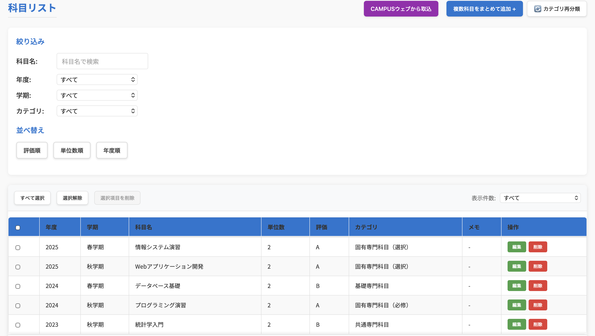
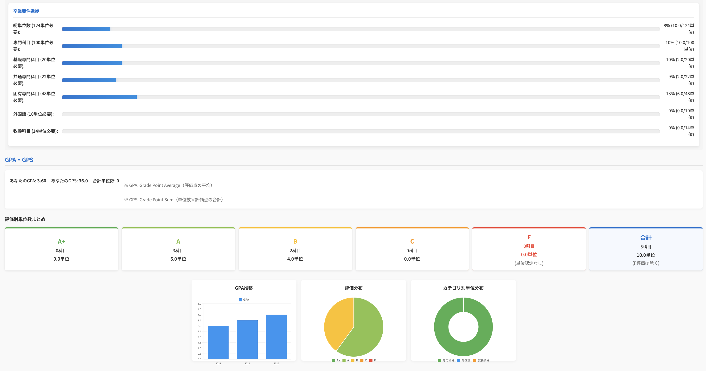

# seiseki-kanri

成績・単位情報を管理し、GPA/GPSや単位取得状況を可視化するためのFlask製Webアプリです。

大学の成績ページから取得したHTMLを手動で貼り付け、科目名・単位数・評価・年度・カテゴリなどを整理できるようにすることを目的に作成しました。

> **注意**  
> このアプリは大学公式のサービスではありません。  
> 個人開発・学習目的で作成した非公式ツールです。  
> 成績情報や個人情報を扱うため、通常はローカル環境での利用を想定しています。
> 公開デモを用意する場合も、実際の成績情報や個人情報は登録せず、ダミーデータのみを使用してください。

---

## 公開デモ

ブラウザから動作を確認できます。

- [成績管理アプリを開く](https://seiseki-kanri.onrender.com/)
- [稼働確認用エンドポイント](https://seiseki-kanri.onrender.com/healthz)

公開デモはRenderの無料インスタンスで運用しています。初回アクセスに時間がかかる場合があります。実際の成績HTML、大学ID・パスワード、個人情報は入力せず、サンプルデータのみを使用してください。

---

## 概要

このアプリでは、成績情報を手動入力またはHTML貼り付けによって登録し、以下のような情報を確認できます。

- 登録した科目一覧
- GPA / GPS の自動計算
- 取得単位数の集計
- カテゴリ別の単位取得状況
- 年度別のGPA推移
- 評価別の単位分布
- ダミーのサンプルデータによる画面確認
- 自分の成績データのCSV出力
- 匿名公開を選択できる講義レビュー
- 登録ユーザー間の簡易ランキング表示

成績データはSQLiteに保存されます。

---

## 画面イメージ

> 以下はダミーデータを用いた画面例です。実際の成績情報は含まれていません。

### 科目管理画面



### GPA・単位取得状況の可視化画面



---

## 主な機能

### 成績データ管理

科目ごとに以下の情報を登録・編集・削除できます。

- 年度
- 学期
- 科目名
- 単位数
- 評価
- 科目カテゴリ
- メモ

### HTML貼り付けによる一括インポート

立命館CAMPUSの成績表HTMLを手動で貼り付けることで、科目情報をまとめて取り込めます。

外部APIと自動連携するものではなく、ユーザーが取得したHTMLをアプリの解析APIへ送って解析する仕組みです。成績情報を含むため、実際のHTMLはローカル環境で利用し、公開デモには貼り付けないでください。

大学のID・パスワードをこのアプリに入力させる自動ログイン機能は実装していません。大学公式サービス以外への認証情報の入力を避け、CAMPUS WEBで手動ログインした後に、ユーザーが明示的に取得したHTMLだけを取り込む設計にしています。

立命館大学はCAMPUS WEBについて、2026年8月27日から画面デザインを刷新し、ログイン後90分でセッションタイムアウトすると案内しています。また、大学公式サービス以外のアプリに大学ID・パスワードを入力しないよう注意喚起しています。詳しくは[立命館大学の案内](https://www.ritsumei.ac.jp/rsp/)と[大学公式サービス以外の利用について](https://www.ritsumei.ac.jp/rsp/assets/file/manaba_kousiki.pdf)を確認してください。

### GPA / GPS の可視化

登録された評価と単位数をもとに、GPAやGPSを自動計算します。

また、年度別のGPA推移や評価別の単位数をグラフで確認できます。

### 単位取得状況の確認

カテゴリごとに取得単位数を集計し、卒業要件に対する進捗を確認できます。卒業に必要な総単位数はプロフィール画面から変更できます。カテゴリごとの内訳は現時点で立命館大学のカリキュラムを前提にしています。

### ユーザー登録・ログイン

Flask-Loginを用いて、ユーザーごとに成績データを分けて管理できます。

### 初回利用とサンプルデータ

科目が未登録のユーザーは、手動入力・複数科目の一括追加・対応形式のHTML取込に加えて、ダミーのサンプルデータを読み込んで画面を確認できます。サンプルデータは実際の成績情報を含みません。

### CSV出力

ログイン中のユーザー自身の成績だけをCSV形式でダウンロードできます。データのバックアップや、他のツールでの再利用を想定した機能です。

### 講義レビュー

科目コード・担当者・開講時期・難易度・課題量・出席・評価方法・コメントを記録できます。公開を選んだレビューは匿名で集計され、他ユーザーは科目ごとの平均値とコメントを確認できます。コメントは500文字以内で、通報されたレビューは公開一覧から外れます。公開しないレビューは自分用の講義メモとして利用できます。

---

## 使用技術

### バックエンド

- Python
- Flask
- SQLite
- Flask-Login
- Flask-WTF
- BeautifulSoup4

### フロントエンド

- HTML
- CSS
- JavaScript
- Chart.js

### その他

- Git / GitHub
- python-dotenv

### 品質・運用

- Gunicornによる本番起動
- `/healthz`による稼働確認
- GitHub ActionsによるPythonコンパイル・スモークテスト
- Dependabotによる依存パッケージとActionsの定期確認

---

## 実装の流れ

### 成績管理

1. ブラウザからログインユーザーの科目データを取得する
2. FlaskのAPIがSQLiteから現在のユーザーに紐づくデータだけを返す
3. JavaScriptがGPA・GPS・取得単位・卒業要件の進捗を再計算して画面へ反映する
4. Chart.jsで年度別推移や評価分布を可視化する

### HTMLインポート

1. ユーザーが大学ポータルから成績表のHTMLをコピーする
2. FlaskがBeautifulSoupでテーブルを解析し、科目名・単位数・評価などを抽出する
3. 解析結果をプレビュー表示し、ユーザーが確認してからSQLiteへ登録する

ユーザーごとのデータ取得・追加・更新・削除には必ずログインユーザーのIDを条件に含めています。HTMLインポートは立命館CAMPUSの構造を前提としており、外部サービスへ自動ログインする設計ではありません。

### 講義レビュー

1. ユーザーが科目情報と評価を入力する
2. 公開を選んだレビューだけを科目コードまたは正規化した科目名で集計する
3. 他ユーザーにはユーザーIDを返さず、匿名コメントと平均値だけを表示する
4. 通報されたレビューは公開結果から除外する

---

## 工夫した点

### 1. 成績HTMLの解析処理

成績ページのHTMLをBeautifulSoupで解析し、科目名・単位数・評価・年度・学期などを抽出できるようにしました。

単純な手入力だけでなく、HTML貼り付けによる一括登録に対応したことで、入力の手間を減らしています。

### 2. GPA / GPS の自動計算

登録された評価と単位数をもとに、GPAとGPSを自動計算するようにしました。

F評価や年度不明の科目の扱いも考慮し、単位取得数とGPA計算で扱いを分けています。

### 3. 単位取得状況の可視化

カテゴリ別の単位数や評価分布をグラフで表示し、現在の単位取得状況を直感的に確認できるようにしました。

### 4. ユーザーごとのデータ分離

Flask-Loginを用いてログイン機能を実装し、各ユーザーが自分の成績データのみを管理できるようにしました。

### 5. 公開リポジトリを意識した設定

`.env`やSQLiteデータベースをGit管理に含めないようにし、環境変数のサンプルとして`.env.example`を用意しています。

### 6. 公開デモ時のデータ保護

ユーザーIDを条件に含めて成績データを取得・更新し、CSV出力もログイン中のユーザー自身のデータに限定しています。ユーザー間で成績を共有するランキング機能は、本番環境では無効化できるようにしました。

講義レビューも公開範囲を明示的に選択する設計にし、公開データにはユーザーIDを含めません。自由記述は画面上でテキストとして描画し、通報されたレビューは公開一覧から外します。

---

## セットアップ

### 1. リポジトリをクローン

```bash
git clone https://github.com/GoNakano/seiseki-kanri.git
cd seiseki-kanri
```

### 2. 仮想環境を作成

```bash
python3 -m venv .venv
source .venv/bin/activate
```

Windowsの場合:

```bash
.venv\Scripts\activate
```

### 3. 依存関係をインストール

```bash
pip install -r requirements.txt
```

### 4. 環境変数ファイルを作成

```bash
cp .env.example .env
```

`.env`内の`SECRET_KEY`や`ADMIN_PASSWORD`は必要に応じて変更してください。

### 5. アプリを起動

```bash
python3 app.py
```

開発環境では、以下のURLからアクセスできます。

```text
http://localhost:5000
```

ポートが使用中の場合は、`.env`の`PORT`を変更してください。

```env
PORT=5001
```

## デプロイ時の起動

公開環境では、`Procfile`に定義したGunicornからアプリケーションを起動します。

```text
gunicorn --bind 0.0.0.0:$PORT app:app
```

公開環境では、以下の環境変数を必ず設定してください。

- `FLASK_ENV=production`
- `SECRET_KEY`：推測されにくいランダムな値
- `ENABLE_RANKING=false`：公開デモではランキングを無効化
- `ENABLE_DEMO_ADMIN=false`：公開デモでは初期管理者を作成しない
- `ADMIN_PASSWORD`：`ENABLE_DEMO_ADMIN=true`にする場合のみ、初期管理者用に設定

稼働確認には`/healthz`へアクセスし、`{"status": "ok"}`が返ることを確認します。

公開デモでは、実際の成績情報を登録しないでください。SQLiteを利用しているため、デプロイ先のファイル保存仕様とバックアップ方法も確認してください。

ランキング機能は、学生の成績情報をユーザー間で共有するため、公開環境では`ENABLE_RANKING=false`を推奨します。デモ用の初期管理者アカウントも、必要な場合だけ`ENABLE_DEMO_ADMIN=true`で有効化してください。

---

## 開発用初期アカウント

開発環境では、初回起動時に管理者ユーザーが作成されます。公開環境では、`ENABLE_DEMO_ADMIN=true`にした場合のみ`ADMIN_PASSWORD`の設定が必要です。

```text
ユーザーID: admin
開発環境のパスワード: admin1234
公開環境のパスワード: ADMIN_PASSWORD に設定した値
```

公開環境でデモ用管理者を使う場合は、必ず強力な`ADMIN_PASSWORD`を設定してください。実際の成績情報や個人情報を登録しない運用を前提とします。

---

## 使い方

### 手動で科目を追加する

1. ログインする
2. 科目追加フォームに科目名・単位数・評価などを入力する
3. 追加ボタンを押す
4. 科目一覧やGPA/GPSに反映される

初めて画面を試す場合は、科目がない状態で表示される「サンプルデータで試す」からダミーデータを読み込めます。

### HTMLから一括インポートする

1. 大学ポータルの成績ページを開く
2. 成績表部分のHTMLを取得する
3. アプリのHTMLインポート機能に貼り付ける
4. 解析結果を確認する
5. 問題なければ一括登録する

### 成績をCSVで保存する

1. ホーム画面の「CSV出力」を押す
2. 自分の成績データだけがCSVファイルとしてダウンロードされる

---

## 注意事項

このアプリは非公式の個人開発アプリです。

- 大学公式のサービスではありません
- 外部サービスと自動連携するものではありません
- 成績情報や個人情報を扱うため、ローカル環境での利用を想定しています
- 実際の成績データや個人情報を含むDBファイルはGitHubに公開しないでください
- 計算結果はあくまで自己管理用の参考値です
- 大学の制度変更や成績表HTMLの変更により、インポート処理が正しく動作しなくなる可能性があります

---

## 公開時に含めないファイル

以下のファイルはGitHubに公開しないようにしています。

```text
.env
*.db
*.sqlite
*.sqlite3
__pycache__/
.DS_Store
```

成績データを含むSQLiteファイルは、必ずローカル環境で管理してください。

---

## 学んだこと

この開発を通して、以下を学びました。

- Flaskを用いたWebアプリケーション開発
- SQLiteを用いたデータ管理
- Flask-Loginによる認証機能の実装
- BeautifulSoupによるHTML解析
- JavaScriptによる動的なUI更新
- Chart.jsを用いたデータ可視化
- `.env`や`.gitignore`を用いた公開リポジトリの管理
- 個人情報を扱うアプリを公開する際の注意点
- 初回利用時に必要な情報を段階的に提示するUI設計

---

## 品質確認

ローカルでは次のコマンドでPythonファイルのコンパイルとスモークテストを実行できます。

```bash
python -m compileall -q app.py tests
python -m unittest discover -s tests -p "test_*.py"
```

GitHub Actionsでも同じ確認を実行し、pushやPull Request時に起動確認・サンプルデータ・CSV出力・ユーザー間のデータ分離・講義レビューの公開範囲を検証します。依存パッケージとActionsはDependabotで定期確認します。

---

## 今後の改善案

- アプリ構成をファイル分割して保守性を高める
- 科目カテゴリ判定ルールを外部設定ファイルに分離する
- テストケースを拡充し、実データに近いHTML解析も検証する
- 学部・大学ごとのカテゴリ要件を設定できるようにする
- 講義レビューの管理者モデレーションと、通報理由の記録を追加する
- CAMPUS WEBの仕様変更に追従できるインポートアダプターを追加する
- エラーハンドリングを整理する
- UIをより見やすく改善する
- Dockerで起動できるようにする

---

## ライセンス

このリポジトリは個人開発・学習目的で公開しています。
